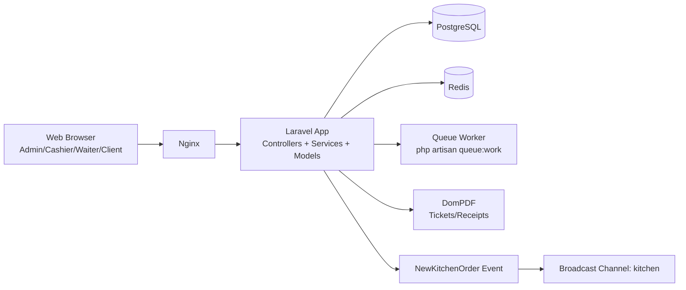

# TechMizane Developer Onboarding Report

Generated: 2026-07-16
Repository: tickMizane (branch: OussoulHouse)

## 1. Purpose and Product Scope

TechMizane is a multi-role POS platform for restaurant and hospitality operations.

Primary personas:
- admin: full back-office control, kitchen supervision, settings, reporting
- caissier: cashier operations, payments, ticket/receipt workflows
- serveur: table and waiter ordering workflows
- public client: QR/self-service ordering (restaurant, pool, room service)

Core business domains:
- menu/catalog management (categories, products)
- table lifecycle and order capture
- kitchen preparation pipeline
- cashier settlement and receipts
- stock movements and supplier procurement
- system settings, permissions, and audit trail

## 2. Technical Stack

Backend:
- Laravel 12
- PHP 8.2
- PostgreSQL 16
- Redis (cache/session and infra support)
- Sanctum for API auth
- DomPDF for ticket/receipt PDF output

Frontend:
- Blade templates
- Vite 7
- Tailwind CSS 4
- Alpine.js
- Chart.js

Infrastructure:
- Docker Compose with dedicated services for app, queue worker, nginx, postgres, redis, adminer

## 3. High-Level Architecture

Application layering pattern used in practice:
- routes define role and auth boundaries
- controllers orchestrate request/response and validation
- services implement transactional business logic
- models encapsulate persistence, relationships, scopes, and helpers
- middleware enforces authentication, role checks, and forced password reset

## 4. Request and Access Model

### 4.1 Route Surfaces

- Web routes in routes/web.php: broad operational surface (100+ route declarations)
- API routes in routes/api.php: versioned under /api/v1 with Sanctum-protected groups

### 4.2 Access Control Layers

Request path for authenticated web users:
1. auth middleware validates session user
2. ForcePasswordReset middleware blocks usage when force_password_reset is true
3. role middleware (CheckRole) enforces role access and active account status
4. optional permission middleware (CheckPermission) can enforce module/action-level rights

Policy registration exists in AppServiceProvider for key entities:
- Product, Category, Vente, Commande, Fournisseur, StockMovement, Paiement, Table

## 5. Core Functional Modules

### 5.1 Authentication and Session Entry

Main controller: app/Http/Controllers/AuthController.php

Behavior:
- admin login supports PIN-style flow with fallback bootstrap admin creation
- staff login requires username + password for caissier/serveur
- successful login updates last_login_at
- force-password-reset path redirects users to password change flow

Important onboarding note:
- ADMIN_PIN appears hardcoded in current code path and should be treated as a security debt to externalize.

### 5.2 Catalog and Inventory

Key models:
- Produit, Category, StockMovement

Inventory logic is centralized in app/Services/StockService.php:
- stock in/out updates
- stock movement recording
- low stock notifications to active admins
- aggregated stock statistics and valuation

### 5.3 Supplier Orders

Domain entities:
- Fournisseur
- Commande (type = supplier)
- CommandeDetail

Service path in app/Services/OrderService.php:
- create supplier order
- update pending order
- mark received and add stock
- cancel pending order

### 5.4 Waiter and Kitchen Pipeline

Waiter entry:
- app/Http/Controllers/WaiterController.php

Kitchen entry:
- app/Http/Controllers/KitchenController.php

Core characteristics:
- kitchen orders represented by Commande with type = kitchen
- status progression includes en_cuisine, en_preparation, pret, servi, payee, annule
- orders can be table-linked or client-originated (user_id null)
- kitchen-only items are filtered via Produit.kitchen_active
- event App/Events/NewKitchenOrder broadcasts kitchen updates

### 5.5 Client QR/Self-Service Ordering

Public endpoints:
- GET /order (menu)
- POST /order/submit (submit order)

Controller: app/Http/Controllers/ClientOrderController.php

Behavior:
- supports location_type: restaurant, pool, room
- creates kitchen Commande with user_id and table_id as null for direct client orders
- triggers kitchen event when preparation is required

### 5.6 Cashier and Payment

Cashier-specific flow combines:
- pending payment discovery for kitchen orders
- settlement and receipt generation
- history and reporting endpoints

Service support:
- app/Services/PaymentService.php (vente payment lifecycle, mixed payments, refunds, cancellations)
- app/Services/OrderService.php (kitchen-order payment path)

Note for contributors:
- both Vente and Commande payment paths exist; understand which path a screen uses before modifying behavior.

### 5.7 Settings and Permissions

Controllers under app/Http/Controllers/Settings:
- UserManagementController
- PermissionManagementController
- SystemSettingsController
- DocumentationController
- WifiQrController

Permission records use UserPermission model with module/action/allowed fields.

## 6. Data Model Overview

Main entities to know first:
- User
- Category
- Produit
- Table
- Commande and CommandeDetail
- Vente and VenteDetail
- Paiement
- StockMovement
- Historique
- UserPermission
- Setting and Documentation

High-level relation map:
- products belong to categories
- sales and orders have detail line-items
- payments attach to sale/order contexts
- tables carry occupancy and active commerce context
- historique captures model activity logs across domains

## 7. Runtime and Infrastructure

Current docker-compose.yml design:
- postgres with healthcheck and performance flags
- redis with append-only persistence
- app service (php-fpm)
- queue worker service
- nginx reverse proxy
- adminer for DB inspection

Startup dependency chain:
- postgres and redis healthy before app
- app healthy before nginx and queue

Operational implication:
- asynchronous behavior (notifications/events/jobs) depends on running queue worker container.

## 8. Testing Footprint

Current suite includes unit and feature tests across:
- auth and force-password-reset
- POS checkout and payment flows
- cashier ticket reporting
- kitchen/payment workflow
- client ordering
- settings modules (users, permissions, system settings)

Representative test locations:
- tests/Feature
- tests/Unit

## 9. Local Development Setup

Preferred setup route:
1. configure environment files (.env and .env.testing)
2. start infrastructure with Docker Compose
3. install composer and npm dependencies
4. run migrations and seeders
5. start app and queue processes
6. run tests

Useful commands:
- docker compose build
- docker compose up -d
- docker compose exec app php artisan migrate --seed
- docker compose exec app php artisan test
- docker compose logs -f app

Seeders wired via DatabaseSeeder:
- UsersSeeder
- FournisseursSeeder
- CategoriesSeeder
- ProduitsSeeder
- TablesSeeder
- RestaurantSettingsSeeder
- DocumentationSeeder
- DashboardStatsSeeder

## 10. Suggested Onboarding Path for New Developers

Day 1 (orientation):
1. Read routes/web.php and routes/api.php to understand role boundaries.
2. Read AuthController, CheckRole, ForcePasswordReset.
3. Review Commande, Produit, Vente, Table models.

Day 2 (business flows):
1. Trace waiter -> kitchen -> cashier through WaiterController, KitchenController, CashierPosController, and OrderService.
2. Trace POS sale and payment flow via PosController and PaymentService.
3. Explore low-stock and supplier order paths via StockService and OrderService.

Day 3 (quality and contribution):
1. Run and inspect Feature tests for payment, client order, and settings.
2. Review policy and permission architecture.
3. Pick one small issue and submit a PR touching one module end-to-end (controller + service + test).

## 11. Known Risks and Technical Debt

Observed risks for team awareness:
- Security: admin PIN behavior is embedded in application code and should be externalized/rotatable.
- Documentation drift: DOCKER_SETUP.md still references older MySQL assumptions while runtime uses PostgreSQL.
- Status complexity: kitchen/cashier flows rely on several status values; regressions are likely without scenario tests.
- Dual payment paradigms: both Vente and kitchen Commande settlements coexist and can diverge if changed independently.

## 12. Practical Contribution Guidelines

When changing business behavior:
- prefer service-layer changes over controller-heavy logic
- keep status transitions explicit and validated
- update or add Feature tests for each changed flow
- validate table-release side effects when modifying payment/cancel logic
- avoid schema changes without reviewing index impact on dashboard and kitchen queries

When changing security/access:
- test role + permission + active status + force-password-reset interactions
- verify both web and API paths

## 13. Key Files to Read First

Core navigation shortlist:
- routes/web.php
- routes/api.php
- app/Http/Controllers/AuthController.php
- app/Http/Controllers/WaiterController.php
- app/Http/Controllers/KitchenController.php
- app/Http/Controllers/CashierPosController.php
- app/Http/Controllers/ClientOrderController.php
- app/Services/OrderService.php
- app/Services/PaymentService.php
- app/Services/StockService.php
- app/Models/Commande.php
- app/Models/Produit.php
- app/Models/Vente.php
- app/Models/Table.php
- app/Http/Middleware/CheckRole.php
- app/Http/Middleware/CheckPermission.php
- app/Http/Middleware/ForcePasswordReset.php
- docker-compose.yml

## 14. Conclusion

The system is a mature, multi-surface Laravel application with clear domain separation and substantial feature coverage for restaurant operations. The best onboarding strategy is role-flow-first (waiter -> kitchen -> cashier), then service-level deep dives, then targeted test-driven contributions.

This report can be used as a baseline onboarding artifact and should be revised whenever route structure, status lifecycle, or infrastructure topology changes.
